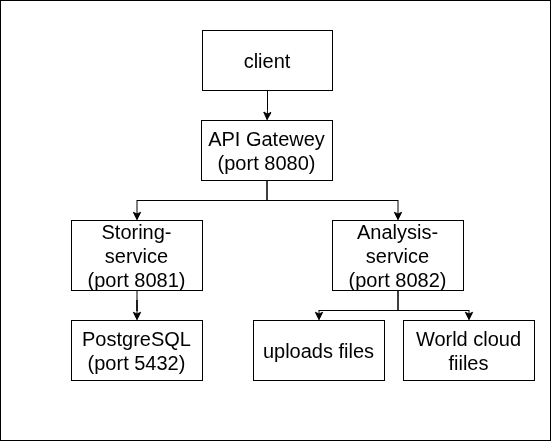

# KosmoSkan - Микросервисная система анализа студенческих работ

## Описание проекта

KosmoSkan - это распределённая система для загрузки, хранения и анализа студенческих работ. Главная особенность системы - автоматическая генерация облаков слов из загруженных файлов, что позволяет визуально оценить содержание работы по частоте встречаемости ключевых терминов.

Система реализована в виде микросервисной архитектуры с использованием API Gateway, что обеспечивает слабую связанность компонентов и возможность независимого масштабирования каждого сервиса.

### Основные возможности

- Загрузка файлов форматов PDF, DOCX, TXT
- Автоматический анализ формата и размера файла
- Извлечение текста из PDF и DOCX документов
- Генерация облаков слов с фильтрацией стоп-слов русского и английского языков
- REST API с интерактивной документацией Swagger/OpenAPI
- Контейнеризация всех компонентов с помощью Docker
- Покрытие кода тестами не менее 60%

## Архитектура системы

Система состоит из четырёх основных компонентов:

**API Gateway (порт 8080)** - единая точка входа в систему. Выполняет маршрутизацию запросов между клиентом и внутренними сервисами, агрегирует Swagger-документацию всех микросервисов. Реализован на базе Spring Cloud Gateway.

**File Storing Service (порт 8081)** - отвечает за приём загружаемых файлов, генерацию уникальных имён (UUID), сохранение файлов на диск и хранение данных в базе данных PostgreSQL. При успешной загрузке автоматически инициирует анализ файла через Analysis Service.

**File Analysis Service (порт 8082)** - выполняет анализ загруженных работ: извлекает текст из файлов, валидирует формат и размер, генерирует облако слов с использованием библиотеки Kumo, сохраняет отчёт анализа в базу данных.

**PostgreSQL (порт 5432)** - реляционная база данных для хранения информации о студентах, работах, submissions и отчётах анализа.

## Пользовательские сценарии

### Сценарий 1: Загрузка файла и автоматический анализ

1. Клиент отправляет POST-запрос на `/api/submissions/upload` через API Gateway, передавая файл и метаданные (имя студента, название работы).
2. Gateway перенаправляет запрос в File Storing Service.
3. Storing Service ищет студента в базе данных по ФИО. Если студент не найден - создаёт новую запись.
4. Storing Service ищет работу по названию. Если работа не найдена - создаёт новую запись.
5. Storing Service генерирует уникальное имя файла (UUID + оригинальное имя) и сохраняет файл в директорию `/app/uploads`.
6. Storing Service создаёт запись Submission в базе данных со статусом UPLOADED.
7. Storing Service через WebClient отправляет POST-запрос в Analysis Service на endpoint `/api/analysis/submissions/{id}/analyze`.
8. Analysis Service получает данные о submission из Storing Service через GET-запрос.
9. Analysis Service проверяет, существует ли уже отчёт анализа для данного submission. Если существует - возвращает его без повторной обработки.
10. Analysis Service извлекает текст из файла: для PDF используется Apache PDFBox, для DOCX - Apache POI, для TXT - прямое чтение.
11. Analysis Service генерирует облако слов: текст разбивается на слова, подсчитывается частота встречаемости, фильтруются стоп-слова, с помощью библиотеки Kumo создаётся PNG-изображение.
12. Analysis Service сохраняет отчёт в базу данных со статусом COMPLETED и путём к файлу облака слов.
13. Результат возвращается клиенту через цепочку сервисов.

### Сценарий 2: Получение облака слов

1. Клиент отправляет GET-запрос на `/api/wordcloud/submission/{id}` через API Gateway.
2. Gateway перенаправляет запрос в File Analysis Service.
3. Analysis Service ищет отчёт анализа в базе данных по ID submission.
4. Если отчёт не найден или поле wordCloudPath равно null - возвращается HTTP 404.
5. Если облако слов существует - файл читается с диска и возвращается клиенту как изображение PNG.

### Сценарий 3: Получение списка всех отчётов анализа

1. Клиент отправляет GET-запрос на `/api/analysis/reports`.
2. Gateway перенаправляет запрос в File Analysis Service.
3. Analysis Service выполняет запрос SELECT ко всем записям таблицы analysis_reports.
4. Список отчётов возвращается клиенту в формате JSON.

### Сценарий 4: Обработка ошибок

Если файл имеет недопустимый формат (не pdf, docx или txt) или превышает максимальный размер (1 MB), Analysis Service устанавливает статус отчёта FAILED и сохраняет описание ошибки в поле errorMessage. Облако слов в этом случае не генерируется.

При возникновении ошибок извлечения текста или генерации облака слов анализ не прерывается - отчёт сохраняется со статусом COMPLETED, но поле wordCloudPath остаётся пустым.

## API Endpoints

### File Storing Service

- `POST /api/submissions/upload` - загрузка файла (multipart/form-data)
- `GET /api/submissions` - получение списка всех submissions
- `GET /api/submissions/{id}` - получение submission по ID

### File Analysis Service

- `POST /api/analysis/submissions/{id}/analyze` - запуск анализа submission
- `GET /api/analysis/reports` - получение списка всех отчётов
- `GET /api/analysis/reports/submission/{id}` - получение отчёта по ID submission
- `GET /api/wordcloud/submission/{id}` - скачивание облака слов (возвращает PNG)

### Swagger UI

- Gateway: http://localhost:8080/swagger-ui.html
- Storing Service: http://localhost:8081/swagger-ui.html
- Analysis Service: http://localhost:8082/swagger-ui.html

## Запуск системы

### Запуск

docker compose up -d